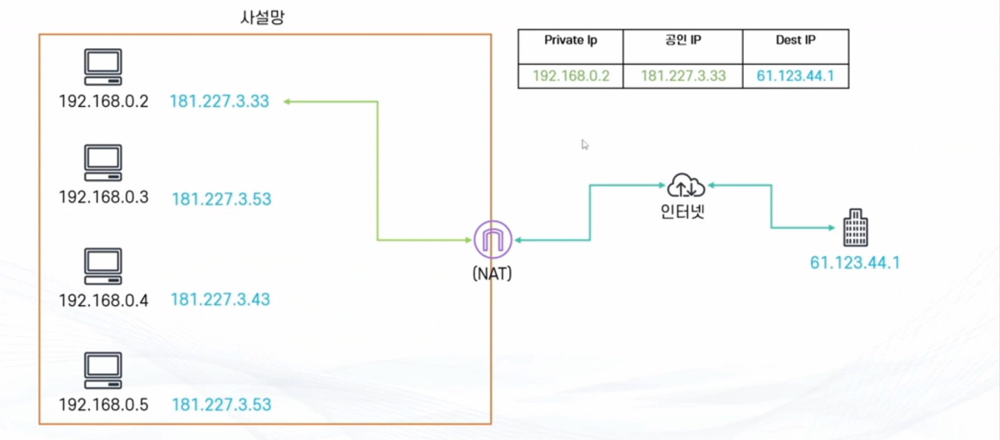
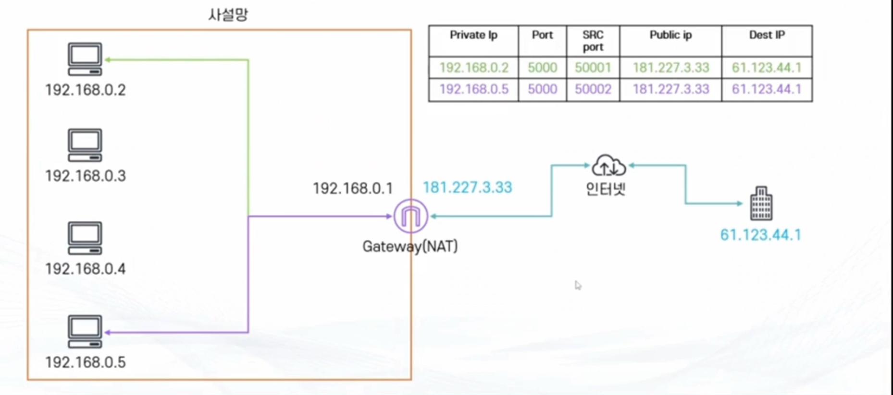
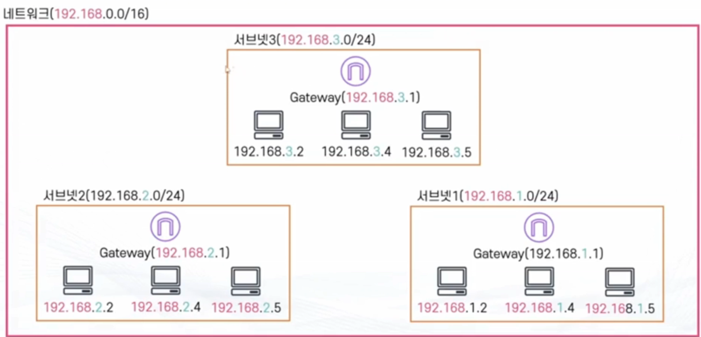
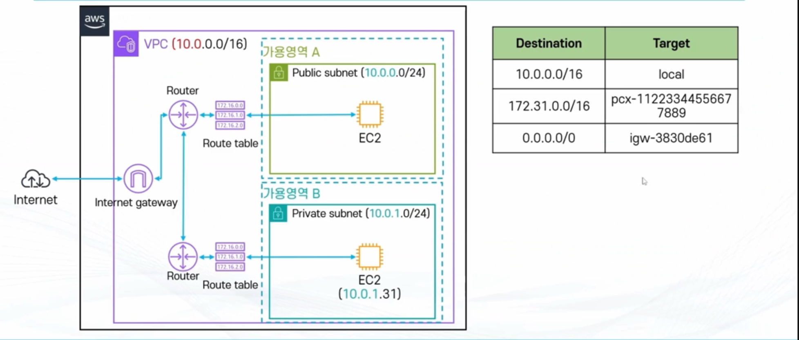
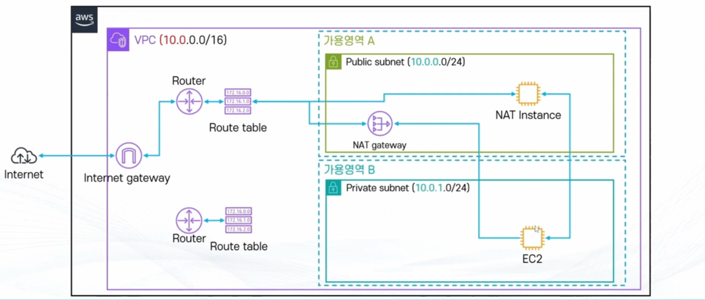

# AWS VPC

# 사설망과 CIDR

> 사설망
- 한정된 IP 주소를 최대한 활용하기 위해 IP 주소를 분할하고자 만든 개념
    - IPv4 기준 최대 IP 갯수 43억개
- 사설망
    - 사설망 내부에는 외부 인터넷 망으로 통신이 불가능한 사설 IP로 구성
    - 외부로 통신할 때는 통신 가능한 공인 IP로 나누어 사용
    - 하나의 망에는 사설 IP를 부여받은 기기들과 NAT 기능을 갖춘 Gateway로 구성

---

## NAT

> NAT
- 사설 IP가 공용 IP로 통신 할 수 있도록 주소를 변환해주는 방법
- 3가지 종류
    - Dynamic NAT : 1개의 사설 IP를 가용 가능한 공인 IP로 연결
        - 공인 IP 그룹(NAT pool)에서 현재 사용 가능한 IP를 가져와서 연결
    - Static NAT : 하나의 사설 IP를 고정된 하나의 공인 IP로 연결
        - AWS Interenet Gateway가 사용하는 방식
    - PAT(Port Address Translation) : 많은 사설 IP를 하나의 공인 IP로 연결
        - NAT Gateway/NAT Instance가 사용하는 방식
    
참고그림

>하나씩 매핑을 해서 각자 하나씩 공인 IP를 가지고 있는 방식

---

## Private Network

A 클래스 : 10.0.0.0 ~ 10.255.255.255 
B 클래스 : 172.16.0.0 ~ 172.31.255.255
C 클래스 : 192.168.0.0 ~ 192.168.255.255

갯수 : A > B > C ( 16,777,216 > 104,857 > 65,536 )
규모 : A > B > C ( 24bit > 20bit > 16bit ) [bit block 수]

---

## CIDR

>Classless Inter Domain Routing
- IP는 주소의 영역을 여러 네트워크 영역으로 나누기 위해 IP를 묶는 방식
- 여러개의 사설망을 구축하기 위해 망을 나누는 방법

>CIDR Notation
- IP 주소의 **집합**
- 네트워크 주소와 호스트 주소로 구성
- 각 호스트 주소 숫자 만큼의 아이피를 가진 네트워크 망 형성 가능
- A.B.C.D/E 형식
    - 예: 10.0.1.0/24 , 172.16.0.0/12
    - A,B,C,D : 네트워크 주소 + 호스트 주소 표시
    - E : 0~32 : 네트워크 주소가 몇 bit 인지 표시

>CIDR Block
- 호스트 주소 비트만큼 IP 주소를 보유 가능
- 예: 192.168.2.0/24
    - 네트워크 비트 24
    - 호스트 주소 = 32 -24 = 8
    - 즉 2^8 = 256개의 IP 주소 보유
    - 192.168.2.0 ~ 192.168.2.255 까지 총 256개 주소를 의미

---

## 서브넷

> 서브넷
- 네트워크 안의 네트워크
- 일정 IP주소의 범위를 보유
    - 큰 네트워크에 부여된 IP 범위를 조금씩 잘라 작은 단위로 나눈 후 각 서브넷에 할당

---
---

## Virtual Private Cloud(VPC)

**VPC=가상으로 존재하는 데이터 센터**

>VPC
- 가상의 데이터센터
- 원하는 대로 사설망을 구축 가능
    - 부연된 IP 대역을 분할하여 사용 가능
- 리전 단위

>VPC 사용 사례
- EC2 , RDS, Lambda 등의 AWS의 컴퓨티 서비스 실행
- 다양한 서브넷 구성
- 보안 설정 (IP Block, 인터넷에 노출 되지 않는 EC2등 구성)

>서브넷이란?
- VPC의 하위 단위로 VPC에 할당된 IP를 더 작은 단위로 분할한 개념
- 하나의 서브넷은 하나의 가용영역(AZ)안에 위치
- CIDR block range로 IP 주소 지정
    - IPv4, IPv6
- IPv4의 경우 최소 /28 CIDR 이상 ~ 최대 /16
    - 즉 호스트 비트가 32-28=4, 따라서 2^4=16 -5 =11 최소 11개 IP 이상 보유
-IPv6의 경우 /44~/64

## AWS 서브넷의 IP 갯수

> AWS 서브넷의 IP 갯수
- AWS의 사용 가능 IP숫자는 5개를 제외하고 계산
- 예: 10.0.0.0/24 라면,
    - 10.0.0.0 : 네트워크 어드레스
    - 10.0.0.1 : VPC Router
    - 10.0.0.2 : DNS Server
    - 10.0.0.3 : 미래에 사용을 위해 남겨 둠
    - 10.0.0.255(마지막 번호) : 네트워크 브로드캐스트 어드레스(단 브로드캐스트는 지원하지 않음)
    - 즉 총 사용한 IP 갯수 256 - 5 = 251

---

## VPC Router
> VPC Router
- VPC에 있는 가상의 라우터로 서브넷에서 오고가는 트래픽을 라우팅
    - 즉 모든 서브넷으 ㅣ트래픽은 VPC 라우터를 거쳐서 목적직에 도달
- VPC 생성시 자동으로 생성되며 별도로 관리할 필요가 업승ㅁ.
    - 별도의 설정은 불가능하며, Route Table만 관리 가능

---

## 라우트 테이블
> 라우트 테이블
- VPC 라우터에서 트래픽이 어디로 가야 할지 알려주는 이정표
- VPC 생성시 기본으로 하나 제공
- 구성 요소
    - Destination : 트래픽이 가고자 하는 주소
    - Target : 트래픽을 실제로 보내줄 대상
        - 논리적 리소스의 아이디로 표현 (예: Internet Gateway의 경우 IGW-xxxxxx)

---

## 서브넷의 종류
> 퍼블릭 서브넷 : 외부에서 인터넷을 통해 연결할 수 있는 서브넷
- 인터넷 게이트웨이(IGW) 를 통해 외부의 인터넷과 연결되어 있음.
- 안에 위치한 인스턴스에 퍼블릭 IP 부여 가능
- 웹서버, 어플리케이션 서버 등 유저에게 노출되어야 하는 인프라

>프라이빗 서브넷: 외부에서 인터넷을 통해 연결할 수 없는 서브넷
- 외부 인터넷으로 경로가 없음
- 퍼블릭 IP 부여 가능
- 데이터베이스, 로직 서버 등 외부에 노출 될 필요가 없는 인프라

---

## 인터넷 게이트우에
> 인터넷 게이트웨이
- VPC가 외부의 인터넷과 통신할 수 있도록 경로를 만들어주는 리소스
- 기본적으로 확장성과 고가용성이 확보되어 있음.
- IPv4, IPv6 지원
    - IPv4의 경우 NAT 역할
- Route table 에서 경로 설정 후에 접근 가능
- 무료

---

## 기본 VPC 와 커스텀 VPC

> 기본 VPC
- AWS 계정 생성시 자동으로 생성되어 있음.
- 기본적으로 각 AZ마다 서브넷을 생성
    - 모든 서브넷에 인터넷 접근이 가능함 (=퍼블릭 서브넷)
- 다양한 AWS 서비스가 기본 VPC를 이용하기 때문에, 삭제시 여러 AWS 서비스의 사용에 제약

>커스텀 VPC
- 직접 생성
- 기본적으로 인터넷에 연결되어 있지 않음.
    - 인터넷 게이트웨이와 라우팅 설정 없이 퍼블릭 서브넷 생성 불가능
    - 즉, 별도의 조치 없이 인터넷으로 연결 가능한 EC2 생성 불가능

---

## 정리
> Virtual Private Cloud(VPC)
- 가상의 데이터 센터
- AWS 계정 생성시 기본 VPC와 기본 서브넷이 생성됨
    - 기본 서브넷은 퍼블릭 서브넷
- 리전 단위

>서브넷 (subnet)
- VPC의 하위 단위로 VPC에 할당된 IP를 더 작은 단위로 분할한 개념
- 하나의 서브넷은 하나의 가용영역(AZ) 안에 위치
- 퍼블릭 서브넷 : IGW를 통해 인터넷과 연결되어 있는 서브넷
- 프라이빗 서브넷 : 인터넷과 연결되어 있지 않은 서브넷
- CIDR Notation으로 IP 주소 지정

---
---

# NAT Gateway 와 Bastion Host
> NAT Gateway/ NAT Instance
- 프라이빗 서브넷의 리소스가 외부의 인터넷과 통신하기 위한 통로
- NAT Instance는 단일 EC2 인스턴스 / NAT Gatyeway는 AWS에서 제공하는 서비스
    - 후자를 요즘 더 많이 사용
    - NAT Gateway 는 고가용성이 확보된 관리형 서비스
- NAT Gateway/Instance는 모두 서브넷 단위
    - Public Subnet에 있어야 함.
    - 고가용성 확보를 위해서는 두 개 이상의 가용영역(서브넷) 필요
- 비용 발생 :
    - $ 0.059 / 시간 
    - $ 0.045 / 1GB 트래픽 처리

