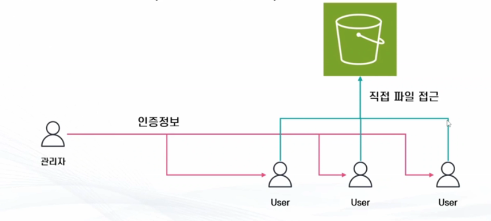
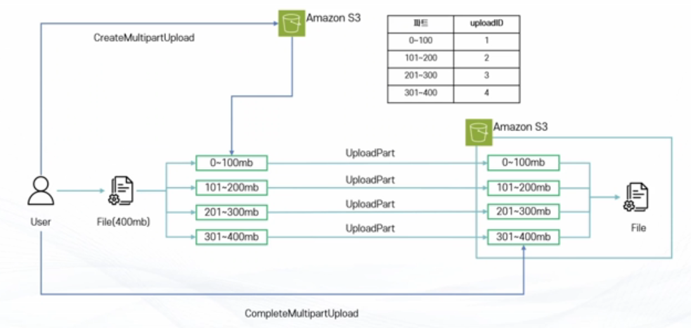
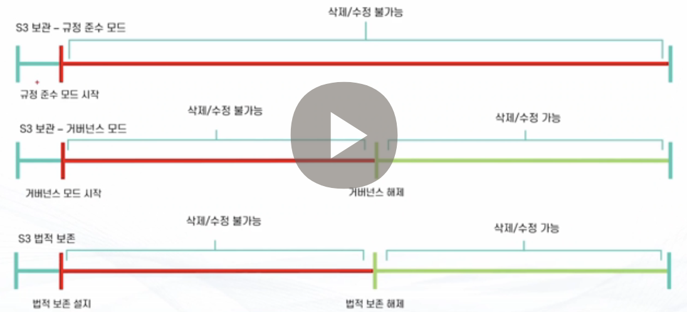
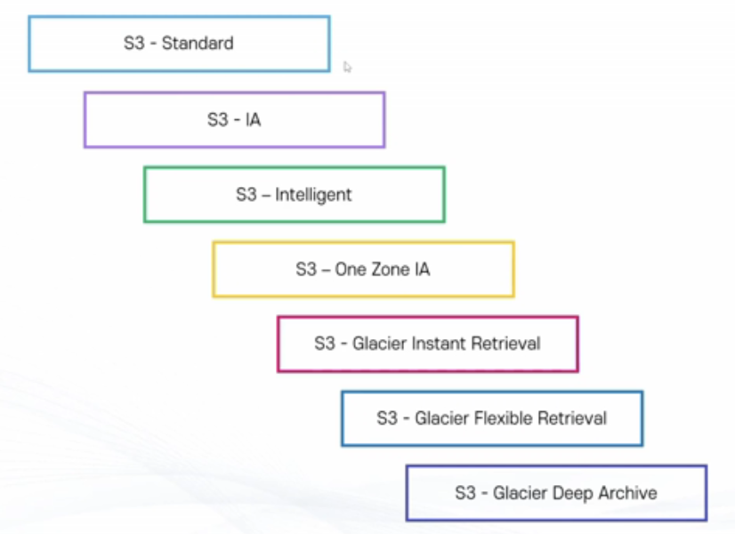
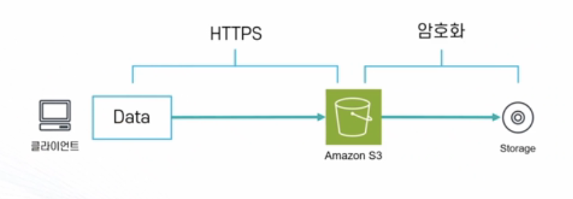
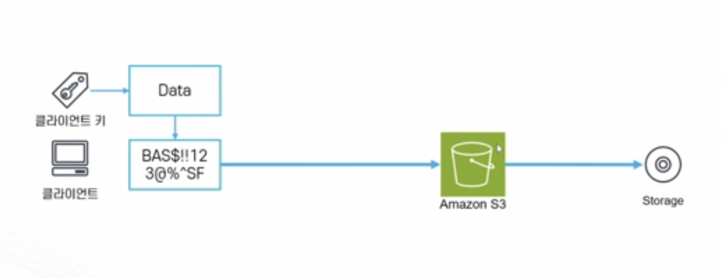

# Amazon S3

## Amazon S3
> Amazon S3
- What: AWS에서 제공하는 Object 스토리지 서비스
- When: 
    - 파일 저장하고 활용하고 싶을 때 (미디어, 로그, 소스코드, 파일, 백업)
    - Static Hosting 기능으로 서버 없이 웹페이지를 제공하고 싶을 때 (서버리스)
    - 기타 파일을 관리하고 싶을 때 (각각 저장하기엔 귀찮고, 교체시 매우 불편[특히 분산된 아키텍처 설계시])
- How:
    - 99.9999999999% 의 내구성(파일을 잃어버리지 않는 능력) /99.99% 의 가용성(원할 떄 파일을 가져갈 수 있는 능력) 을 가진 분산 스토리지로 파일 저장
    - 다양한 기능
        - Presigned URL 제한된 사람에게만 전달, 버저닝/권환 관리
        - 주기적인 복제, 일정기간 파일 삭제 방지, 버저닝, 암호화 등
    
---

 **S3**
 **S3-1**

## 파일 스토리지 vs 오브젝트 스토리지
> 파일 스토리지 vs 오브젝트 스토리지
- 파일 스토리지: 파일을 계층구조로 관리
    - 빠르게 찾고 업데이트 작업 가능
    - 확장이 제한적(수십 테라바이트 수준)
- 오브젝트 스토리지: 파일을 오브젝트(데이터, 메타데이터, 아이디)단위로 관리
    - 정확한 경로를 알아야 찾기 가능
    - 확장이 쉬움(수십 페타바이트 가능)
- 간단한 구분
    - 게임 설치해서 사용 가능하면 파일 스토리지 vs 웹하드/구글 드라이브 처럼 게임 설치 못하면 오브젝트 스토리지

---

# Amazon S3 기초

## Amazon S3
> Amazon S3
- 객체 스토리지 서비스: 파일 보관만 가능 <-> Block Storage Services(EBS, EFS 등)
    - 어플리케이션 설치 불가능
- 글로벌 서비스 단, 데이터는 리전에 저장
- 무제한 용량
    - 하나의 객체는 0byte 에서 5TB의 용량

---

## 버킷
>버킷이란?
- S3의 저장공간을 구분하는 단위
- 디렉터리/폴더와 같은 개념
- 버킷이름은 전 세계에서 고유 값: 리전에 관계 없이 중복된 이름이 존재할 수 없음

---

## S3 객체의 구성
> S3 객체의 구성
- Owner : 소유자
- Key : 파일의 이름
- Value : 파일의 데이터
- Version ID : 파일의 버전 아이디
- Metadata : 파일의 정보를 담은 데이터
- ACL : 파일의 권한을 담은 데이터 (요즘 안 쓰는 추세)
- Torrents : 토렌트 공유를 위한 데이터

---

## S3의 내구성
> S3의 내구성
- 최소 3개의 가용영역(AZ)에 데이터를 분산 저장(Standard의 경우)
- 99.999999% 내구성
    - 0.000000001 % 확률로 파일을 잃어버릴 수 있음
    - 로또보다 어려움 (레전드 사건 발생 AWS는 신이다)
- 99.9 % SLA 가용성 (스토리지 클래스에 따라 다름)

---

## 보안 설정
> S3 보안 설정
- S3 모든 버킷은 새로 생성시 기본적으로 Private(비공개)
    - 따로 설정을 통해 불특정 다수에게 공개 가능 (i.e 웹 호스팅)
- 보안 설정은 객체 단위와 버킷 단위로 구성
    - Bucket Policy : 버킷 단위
    - ACL : 객체 단위
- MFA를 활용해 객체 삭제 방지 가능
- Versioning을 통해 파일 관리 가능
- 액세스 로그 생성 및 전송 가능
    - 다른 버킷 혹은 다른 계정으로 전송 가능

---

## Demo - S3 버킷 생성, 업로드, EC2 유저데이터 활용
> Demo - S3 버킷 생성, 업로드, EC2 유저데이터 활용
- S3 버킷 생성
- 파일 업로드
- S3 접근 권한을 가진 EC2 IAM 역할 생성
- EC2 시작 구성 생성
    - 유저데이터에서 S3 파일을 가져와서 적용하도록 설정

---

## S3 스토리지 ㅣ클래스
> S3 스토리지 클래스
- S3는 다양한 스토리지 클래스를 제공
    - 클래스별로 저장의 목적, 예산에 따라 다른 저장 방법을 적용
    - 총 9가지 클래스

---

> S3 스탠다드
- 99.99% 가용성
- 99.99999999% 내구성
- 최소 3개 이상의 가용영역에 분산 보관
- 최소 보관 기간 없음, 최소 보관 용량 없음.
- 요청 비용 $0.0045/1000 requests (ap-northeast-2 기준)
- 저장 비용 $0.024/1

---

> S3 스탠다드 IA (Infrequently Accessed)
- 자주 사용되지 않는 데이터를 저렴한 가격에 보관
- 최소 3개 이상의 가용영역에 분산 보관
- 최소 저장 요량: 128kb
- 최소 저장 기간 : 30일
- 데이터 요청 비용 발생: 데이터를 불러올 때 마다 비용 지불 (per GB)
    - 요청 비용 $0.01/1000 request vs $0.0045/1000 requets
- 사용 사례: 자주 사용하지 않는 파일 중 중요한 파일
- 저장 비용 : standard /2 

---
 
>S3 One Zone-IA
- 자주 사용되지 않고, 중요하지 않은 데이터를 저렴한 가격에 보관
- 단 한개의 가용 영역에만 보관
- 최소 저장 용량 : 128kb
- 최소 저장 기간: 30일
- 데이터 요청 비용 발생: 데이터를 불러올때마다 비용을 더 많이 지불
    - 요청 비용 $0.01 / 1000
- 사용 사례: 자주 사용하지 않으며 쉽게 복구 할 수 있는 파일
    예 : 오래된 썸네일

---
 
>S3 Express One Zone
- 매우 빠른 퍼포먼스를 위해서 하나의 가용영역에 위치한 특별한 저장소에 저장
    - millisecond 단위의 응답속도(약10배 빠름)
    - standar와 비교해 50 % 저렴한 요청 비용
- Amazon S3 Directory Bucket에 저장
- 컴퓨팅 리소스와 스토리지 리소르를 같은 공간에 위치시켜 더 빠른 액세스 가능
- 몇몇 리전만 사용 가능 (ap-northeast-2 사용 불가능)
- 저장 비용: $0.016/GB 

---
 
> S3 Glacier Instant Retrieval
- 아카이브용 저장소
- 최소 저장 용량 : 128kb
- 최소 저장 기간 : 90일
- 바로 액세스 가능
- 사용 사례: 의료 이미지 혹은 뉴스 아카이브 등
- $0.005/GB(ap-northeast-2기준)

---
 
> S3 Glacier Flexible Retrieval
- 아카이브용 저장소
- 최소 저장 용량 : 40kb
- 최소 저장 기간 : 90일
- 분 ~ 시간 단위 이후 액세스 가능
- 사용 사례 : 장애 복구용 데이터, 백업 데이터 등
- $0.0045

---
 
>S3 Glacier Deep Archieve
- 아카이브용 저장소
- 최소 저장 용량 : 40 kb
- 최소 저장 기간 : 90일
- 데이터를 가져오는데 12~48시간 소요
- 사용 사례: 오래된 로그 저장, 사용할 일이 거의 없지만 법적으로 보관해야 하는 서류 등
- 0.002/GB

---
 
> S3 Intelligent-Tiering
- 머신 러닝을 사용해 자동으로 클래스 변경
- 퍼포먼스 손해/오버헤드 없이 요금 최적화

---
 
> S3 on Ouptosts
- 온프레미스 환경에 S3 제공
- 내구성을 확보한 상태로 파일을 저장하도록 설계
- IAM, S3 SDK 등 사용 가능

---
 
## 정리
> 스토리지 클래스
- 목적과 비용에 따라 9가지 클래스

---

## S3의 권환 관리 방법
> S3의 권한 관리 방법
- IAM 정책 : 자격증명(IAM 사용자, 그룹, 역할) 등에 부여하는 정책으로 S3에 대한 권한 부여/거부
- 버킷 정책 : 버킷 자체에 특정 주체가 행사할 수 있는 권한 부여/거부
    - 주체: IAM 사용자. 역할 등
- ACL : 잘 사용되지 않는 추세

---

## S3의 계층 구조
> S3의 계층 구조
- AWS 콘솔에서는 S3의 디렉토리(폴더)를 생성하고 확인 가능
- S3 내부적으로 계층구조가 존재하지 않음.
    - 키 이름에 포함된 "/" 로 계층 구조를 표현
    - 예:
        - s3://mybucket/world/southkorea/seoul/guro/map.json
        - 버킷명: mybucket
        - 키 : world/southkorea/seouol/guro/map.json (단일 스트링)

---

## S3 버킷 정책
> S3 버킷 정책
- 버킷 단위로 부여되는 리소스 기반 정책
- 해당 버킷의 데이터에 "언제 어디서 누가 어떻게 무엇을" 할 수 있는 정의 가능
    - 리소스의 계층 구조에 따라 권한 조절 가능
        - 예: resource : "arn:aws:s3:::my-bucket/images/*" -> my-bucket의 images/로 시작하는 모든 객체에 대해서 ...
    - 다른 계정에 엔티티에 대해 권한 설정 가능
    - 익명 상용자(Anonymous)에 대한 권한 설정 가능
- 기본적으로 모든 버킷은 Private => 접근 불가능

---

## S3 버킷 관리 방법의 선택
> IAM 정책
- 같은 계정의 IAM 엔티티의 S3 권한 관리할 때
- S3이외에 다른 AWS 서비스와 같이 권한 관리할 때

> 버킷 정책
- 익명 사용자 혹은 다른 계정의 엔티티의 S3 이용 권한을 관리 할 때
- S3 만의 권한을 관리할 때

---

## S3 Access Control List(ACL)
> S3 Access Control List(ACL)
- 버킷 혹은 객체 단위로 읽기, 쓰기 의 권한을 부여
- S3에서 설정을 통해 ACL을 활성화 시킨 후에 저굥ㅇ ㅏㄱ능
- 파일 업로드시 설정 가능
- 간단하고 단순한 권한 관리만 가능
- 점점 사용하지 않는 추세
    - 대부분의 경우 버킷 정책/IAM 정책으로 대체 가능

---

## Demo - S3 권한 부여 (실습)
> Demo - S3 권한 부여
- IAM 정책/버킷 정책으로 S3 버킷에 대한 권한 부여
    - IAM 사용자에 S3 접근을 허용하는 권한 부여(IAM 정책)
    - IAM 사용자에 대한 접근을 허가하는 버킷 정책을 만들어 S3에 붙여 접근 허용 (버킷 정책)

---

## Demo - 나만의 S3 홈 디렉토리 만들기 (실습)
> Demo - 나만의 S3 홈 디렉토리 만들기
- IAM 사용자를 생성해서 해당 사용자만 접근 가능한 S3 버킷 디렉토리 만들기

---

# S3의 업로드/다운로드

## S3의 업로드/다운로드 방법
> S3의 업로드/다운로드 방법
- AWS Web Console
- AWS SDK/AWS CLI (S3와 통신하고 싶을때 사용)
- 일반 URL (버킷/파일이 공개되어 있을 경우, 다운로드만 가능)
- 미리서명된 URL(Presigned URL)

---

## 파일 공유하는 방법
- 영상 공유 서비스
- 인증정보 : IAM 유저, Access Key ID / Secret Access Key

---

## 수동 파일 공유의 문제점
> 수동 파일 공유의 문제점
- IAM 유저의 개수 제한
- 관리가 어려움
- 만료 기간 설정이 어려움
- 유출 시 모두에게 다시 공유 필요
- 세세한 권한 조절 불가능

---

## 미리 서명된 URL(Presigned URL)
> 미리 서명된 URL
- S3의 파일을 안전하게 공유하고 싶을 때 사용
- 생성자가 가진 권한으로 파일에 접근 가능한 임시 URL을 생성
    - URL의 만료 기간 지정 가능
- URL의 권한은 생성자가 가진 권한중 일부 혹은 전체 사용
    - 예: 생성자가 Get 권한이 없다면 URL로 GET 불가능

---

## Amazon S3 멀티파트 업로드
> Amazon S3 멀티파트 업로드
- 하나의 파일을 여러 파트로 나누어서 업로드 하는 방식
- 장점
    - 빠른 속도
    - 파일 업로드의 컨트롤 보장 (예: 중간부터 업로드하기)
- 단점
    - 업로드 로직이 단일 파트보다 조금 더 복잡
    - 업로드에서 발생하는 파일들의 관리 포인트의 증가
- AWS에서는 100mb 이상의 파일을 업로드 할 경우 멀티파트 업로드를 권장

---

## Amazon S3 멀티파트 업로드 진행

---

## 주의사항
> 주의사항
- 멀티파트 업로드가 중지되거나(명시 적 중지가 아닌 에러 등), 업로드 이후 합쳐지지 않은 경우 업로드된 파트 파일은 S3에 잔류
    - ->비용 발생!
    - S3 Storage Lens 등의 서비스로 현재 완료되지 않은 멀티파트 업로드 파일 확인 가능
    - S3 생명주기 설정을 통해 일정 시간 이후 삭제 가능
        - 예: "완료되지 않은 멀티파트 업로드의 경우 7일 후 삭제"

---

## Demo - S3 Upload/Download 실제 구현
> Demo - S3 Upload/Download 실제 구현
- 실제 백엔드/프론트엔드를 기반으로 S3 Upload/Download 구현
- AWS Serverless 서비스인 Lambda 기반 백엔드
    - node.js 18이상 설치 필요
    - aws cli 설치 필요
        - aws 프로파일 설정 필요
- react 기반 프론트엔드

---

# S3 버전 관리 및 객체 잠금

## S3 버전 관리
> S3 버전 관리
- 객체의 생성, 업데이트. 삭제의 모든 단계를 저장
    - 삭제시에는 실제 객체를 삭제하는 대신 삭제 마커를 추가
- 버킷 단위로 활성화 필요(기본적으로 비활성화)
    - 중지 가능, 단 비활성화 불가능
    - 한번 버전 관리를 시작하면 비활성화 불가능(버킷 삭제 후 재생성으로 해결은 가능)
- 수명 주기 관리와 연동 가능
- MFA 인증 후 삭제 기능을 통해 보안 강화 가능

## S3 버전 관리 유의사항
> S3 버전 관리 유의사항
- 중지 가능, 단 비활성화 불가능
    - 한번 버전 관리를 시작하면 비활성화 불가능 버킷 삭제 후 재생성으로 해결은 가능)
- 모든 버전에 대해 비용 발생
    - 10gb 객체의 버전이 5개 있다면, 총 50gb에 대해 비용 발생

---

## S3 객체 잠금
> S3 객체 잠금
- Write Once, Read Many(WORM) 모델을 활용하여 객체를 저장
- 고정된 시간, 혹은 무기한으로 객체의 삭제/덮어쓰기 방지 기능
- 규정 준수 및 객체의 보호를 위해 사용

---

## S3 객체 잠금의 종류
> S3 객체 잠금의 종류
- 종류에 따라 두 가지 모드
    - 보관모드(Retention Mode): 일정 기간동안 수정 방지
        - **규정 준수 모드 : 누구도 잠금 설정 변경, 객체 삭제 불가능** (너무 빡셈)
        - 거버넌스 모드 : 특별한 권한 없이 삭제 혹은 잠금 설정 변경 불가능
            - 객체 상제 방지 혹은 규정에 따라 보관하기 위해 사용
            - 규정 준수 모드의 테스트
    - 법적 보존(Legal Hold)
        - Hold를 객체에 부여하고, Hold가 존재하는 한 객체 삭제, 수정 불가능
        - 제한 기간이 없음

---

> S3 객체 잠금의 종류

---

# S3 수명 주기

## 수명주기
> 수명 주기
- 일정 기간 이후 오브젝트에 상태 변경 가능
    - 전환 작업(Transition actions): 다른 스토리지 티어로 올리기
        - 예: 30일 후 아카이브(Glacier)로 보내기
        - 예: 50일 후 객체를 IA로 보내기
    - 만료 작업(Expriation actions) : 오브젝트를 삭제
- 수명 주기 설정시 소급 적용
    - 예: 30일 이후 만료 작업을 설정했다면 기존 버킷의 모든 30일 이상된 오브젝트도 같이 적용
- 필터 및 날짜 적용 가능
    - 예: /image/thumbnail/production 디렉토리의 5mb 이상 파일을 30일 뒤에 모두 아카이브
    - 예: 2024-05-30 일부터 /image/dev 디렉토리에 1mb 이상 이미지를 모두 삭제

---

## 전환 작업 (transition actions)
> 전환 작업 (transition actions)
- 일정 기간 이후 오브젝트의 스토리지 클래스 변경
    - Waterfall 모델 (폭포수 모델? (개발 프로세스 모델?))
- 제약사항 있음
    - 예: 다른 클래스 -> Standard로 변경 불가능
    - 예: 128KB 미만 파일의 경우 Standard/IA -> S3-Inteligent or Glacier Instant Retrieval 불가능

---

---

## 만료작업(Exipration actions)
> 만료작업(Expiration actions)
- 버저닝에 따라 다른 방식
    - 버저닝이 없을 때: async로 영구 삭제
    - 버저닝이 있을 때 : delete marker가 현재 version이 아니라면 marker 추가후 현재 버전으로 격상
        - 현재 버전이 delete marker라면 동작하지 않음.
    - 삭제날짜에 바로 삭제되지 않고 일정 딜레이 발생 가능
        - 그 동안은 비용 없음.
        - HeadObject/GetObject API로 삭제 예정 확인 가능

---

## 조건
> 조건
- 객체의 수명
    - 전환 혹은 생성부터 일정 기간 경과후 효과 발생
- 날짜
    - 특정 날짜부터 효과 발생, **단 콘솔로 설정 불가능**(확인만 가능)
    - 예: 5월30일 부터 모든 오브젝트 삭제
        - 이 경우 5월30일 이후 다른 오브젝트가 추가되어도 바로 삭제됨
- 필터
    - 두 조건 모두 필터링의 조건을 만족해야 발동

---

## 필터
> 필터
- 필터 : 특정 조건으로 필터링 가능
    - prefix
        - 예: /log, /log/productioin, /image/thumbnails
    - tag
        - 특정 태그가 있을 때
        - And로 연결 가능
    - 오브젝트 사이즈

# 암호화

## S3의 객체 암호화
> S3의 객체 암호화
- S3의 데이터의 암호화는 3가지 단계로 구성
    1. On Transit: SSL/TLS(HTTPs)
    2. At Rest(Server Side)
        - SSE-S3 : S3에서 알아서 암호화(Default)
        - SSE-KMS: KMS 서비스를 이용해 암호화
        - SSE-C : 클라이어늩에서 제공한 암호화키를 통해 암호화
        - DSSE-KMS : KMS를 활용해서 Dual Layer (2 계층) 암호화를 적용하는 암호화
    3. Client Side : 클라이언트가 직접 암호화
- 기본적으로 활성화 (SSE-S3)
- 암호화시 데이터의 복제가 불가능한 경우 발생

---

## Server Side

---

## Client Side 암호화

---

# S3 정적 호스팅

## Static Vs Dynamic Contents

| 정적 파일(Static COntents) | 동적 컨텐츠 (Dynamic Contents) |
| ---- | ---- |
| 서버에 저장된 파일이 모든 사용자에게 동일하게 전달되는 컨텐츠 | 시간, 사용자, 입력 등에 따라 내용이 변경되는 컨텐츠 |
| 매번 서버에 요청할 필요 없이 캐싱 가능 | 매번 서버에 요청하여 내용을 구성하고 전달받아야 함 |
| HTML/Javascript 등으로 구성 | PHP,JSP, ASP.net 등으로 서버 처리 |
| 예 : 이미지, 글, 뉴스 등 | 예 : 로그인이 필요한 내용, 게시판 댓글 등 |

---

## Amazon S3 Static Hosting
> Amazon S3 Static Hosting
- S3를 사용해서 정적 (Static) 웹 컨텐츠를 호스팅하는 기능
- 별도의 서버 없이 웹사이트 호스팅 가능
- 사용 사례: 대규모 접속이 예상되는 사전 예약 페이지, 홍보 페이지, 회사 웹사이트 등
- 장점
    - 고가용성/ 장애 내구성을 확보
    - Serverless
        - 즉 사용한 만큼만 비용을 지불
        - 배포와 수정이 쉬움
- 자체적으로 도메인 주소 변경 , HTTPs 불가능
    - 단 Route53/CloudFront 등과 연동하여 주소 변경 및 HTTPS 구현 가능
    - 주의: Route53 레코드로 Static Hosting을 연결하려면, 버킷명과 도메인명이 같아야 함.

---

## 실습
> 실습
- S3 버킷의 정적 호스팅 기능 활성화 하기
- S3 버킷에 Static Contents 파일을 작성해서 업로득 하기
- S3 정적 호스팅 웹 주소를 사용해 웹사이트 동작 확인하기

---

# 기타 기능

## Amazon S3 액세스 로깅
> Amazon S3 액세스 로깅
- Amazon S3의 버킷을 정해 활동 로그를 다른 S3 버킷에 저장하는 기능
    - 지정한 버킷에 로그 파일 저장
    - 반드시 기록 대상 버킷과 로그 저장 버킷의 분리 필요 무한 파일 생성 방지

---

## 이벤트 호출
> 이벤트 호출
- 객체의 생성/삭제/변경 이벤트 발생 -> 다른 서비스 호출
    - 예: 파일 업로드시 람다를 호출해 파일 무결성 검사!
- SNS, SQS, Lambda 호출 가능

## 기타 기능
> 기타 기능
- 복제(Replication) : 지정 S3 버킷의 변경 내역을 다른 버킷으로 비동기로 복제하는 기능
    - 다른 리전, 다른 계정의 버킷으로도 복제 가능
    - Delete Marker 복제 가능
- Transfer Accelelration: CloudFront를 통해 다운로드를 최적화시키는 서비스
- Request Pay : 버킷의 소유자 대신 요청자가 요청 및 다운로드 비용을 부담하는 모드
    - 주요 사용 사례: 기업간 데이터 공유, 리서치 데이터 공유 등

---

## Amazon Athena
> Amazon Athena
- 인터렉티브 쿼리를 통해 S3의 데이터를 조회할 수 있는 서비스
    - S3를 SQL 기반의 언어로 조회
- 별도의 프로비저닝 혹은 서버 없이 동작 = Serverless
- 사용 사례
    - 여러 로그 파일이 저장된 S3에서 필요한 데이터를 조회
    - 정형화된 메타데이터 혹은 저장 데이터를 조회
    - 이벤트 데이터에서 필요한 정보를 추출 (A/B 테스트)등
- 주로 AWS Glue 서비스로 데이터 스키마 생성

---

## Demo - Athena를 활용한 로그 분석
> Demo - Athena를 활용한 로그 분석
- S3 로그 버킷 생성
- 로그 업로드
- AWS Glue Crawler를 사용해 S3 버킷에 저장된 로그의 스키마 생성
- Amazon Athena tjfwjd
- S3 쿼리

---

끝...!!

