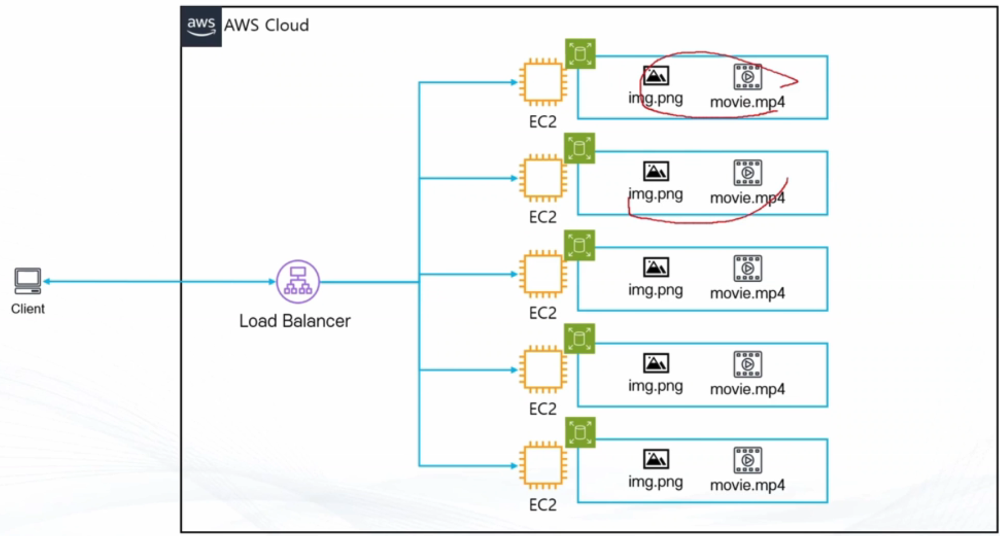
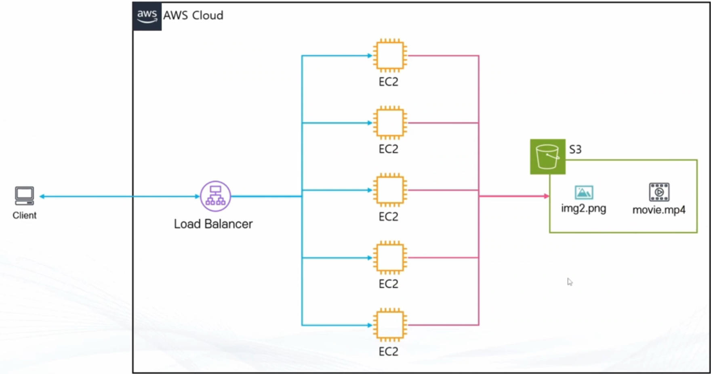

## Amazon S3
> Amazon S3
- What: AWS에서 제공하는 Object 스토리지 서비스
- When: 
    - 파일 저장하고 활용하고 싶을 때 (미디어, 로그, 소스코드, 파일, 백업)
    - Static Hosting 기능으로 서버 없이 웹페이지를 제공하고 싶을 때 (서버리스)
    - 기타 파일을 관리하고 싶을 때 (각각 저장하기엔 귀찮고, 교체시 매우 불편[특히 분산된 아키텍처 설계시])

 **S3**
 **S3-1**

## 파일 스토리지 vs 오브젝트 스토리지
> 파일 스토리지 vs 오브젝트 스토리지
- 파일 스토리지: 파일을 계층구조로 관리
    - 빠르게 찾고 업데이트 작업 가능
    - 확장이 제한적(수십 테라바이트 수준)
- 오브젝트 스토리지: 파일을 오브젝트(데이터, 메타데이터, 아이디)단위로 관리
    - 정확한 경로를 알아야 찾기 가능
    - 확장이 쉬움(수십 페타바이트 가능)
- 간단한 구분
    - 게임 설치해서 사용 가능하면 파일 스토리지 vs 웹하드/구글 드라이브 처럼 게임 설치 못하면 오브젝트 스토리지

