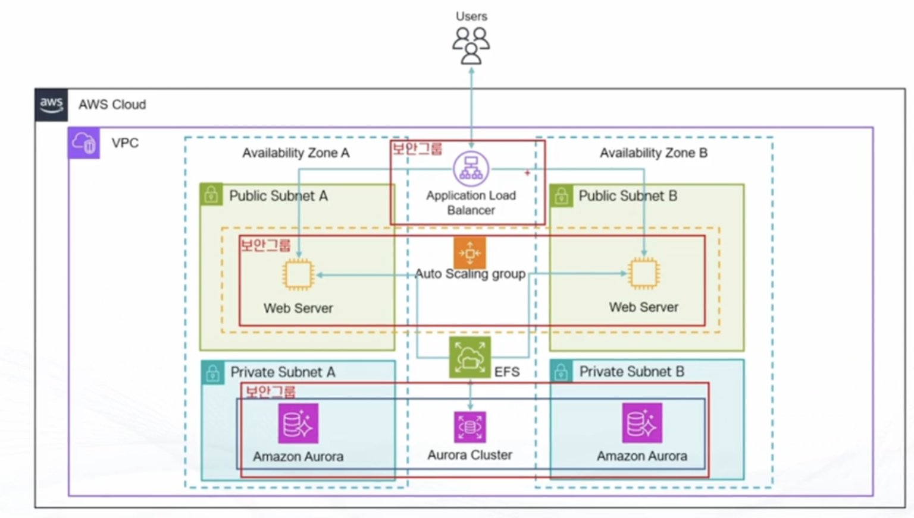

# WordPress 서버 클러스터 구성

## 3-Tier Architecture
> 3-Tier Arhcitecture
-  정형화된 3개의 물리적/논리적 티어로 구성된 어플리케이션 아키텍처
- 3개의 티어로 구성
    - Presentation tier : 사용자와 직접 소통하는 티어로 주로 HTML/CSS와 같은 유저를 위한 UI로 구성
    - Application tier : 실제 로직을 처리하는 티어로 다양한 프로그래밍 언어(PHP, JAVA, Python) 등으로 구성
    - Data tier : 데이터를 저장하는 티어로 주로 데이터베이스 혹은 데이터를 처리하는 저장 공간으로 구성
- 우리는 Application Tier/Data Tier 로만 구성해볼 예정 (2-Tier)

---

>Demo - 2 Tier Application 아키텍처를 활용한 Wordpress 서버
> Demo
- 2 Tier Application 아키텍처를 활용하여 Wordpress 서버를 위한 웹 서버 클러스터 구성
- EC2 Autoscalling 과 ELB로 고가용성 확보
- EFS 를 활용해서 공유 스토리지에 워드프레스 설치
- Amazon Aurora(MySQL 호환)을 사용해 데이터베이스 티어 구현
    - **비용 발생!**

---

---

>순서
- VPC 생성
    - Public/Private Subnet 각각 2개
- 보안그룹 생성 -> RDS용, ALB용, EC2용
- RDS 서브넷 그룹 생성 -> RDS 프로비전
- EFS 생성
- S3 버킷 생성
    - wp-config 업데이트 및 업로드
- 유저데이터 준비 및 EC2 생성
    - 해당 EC2로 Wordpress 생성 - AMI
- 해당 AMI로 Launch Template -> Autoscalling Group + ALB

---

>순서
- EC2 보안그룹이 외부 접속을 막고 있어서 최초 설치경로를 바라보는 파일 로딩 불가능
    - ->직접 로그인해서 경로 수정필요
- 모든 검증이 끝나면 리소스 삭제

---

## 실습 진행!!